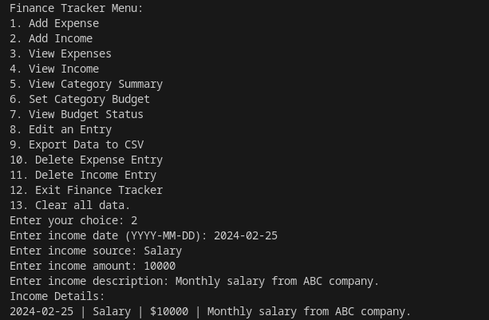
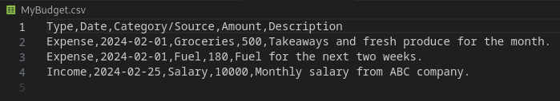

# Finance Tracker Application

## Challenge
To create an application with a simple command line interface where a user can keep track of their financial decisions and situations. The user has a straightforward menu to interact with and is prompted for entries. The user has the option to set a specified budget amount for a chosen category, and when viewing the budget status, the overall budget status is shown as well as the category budget, helping the user to accurately view the whole budget. When viewing expenses, the output is printed in red. When viewing income, the output is printed in green. 'Under Budget' messages are printed in green. 'Over Budget' messages are printed in red.

## I. Design

### a. Modular Design
The code is modularized into different files (e.g., `Income.py`, `Expenses.py`, `UnitTests.py`, `GetUserInput.py`, etc.), focusing on specific functionalities for improved organization and maintainability.

### b. Error Handling and Validation
Includes error handling and validation mechanisms, such as validating date and time formats, handling invalid inputs gracefully, and raising informative exceptions.

### c. User Interface (UI)
The command-line interface provides a simple and user-friendly interaction with clear options for users.

### d. Real-Time Feedback
Provides real-time feedback to users, communicating outcomes (success or errors) during operations like adding, editing, or deleting events.

### e. Export to .csv
Added functionality to export user entries to a .csv file, adding value to the user.

### f. Unit Testing
Includes unit tests in `UnitTests.py` for early issue detection and code maintenance.

See below screenshot for unit testing output:

## II. Diagrams

### Sequence diagram

### Class diagram

## III. Finance Tracker Usage

### a. User Menu

### b. Add Expense
User adds an expense:

### c. Add Income
User adds an income:

### d. View Expenses

### e. View Income

### f. View Category Summary

    
### g. Set Category Budget

### h. View Budget Status

### i. Edit an Entry

### j. Export Data to a CSV file

### k. Delete Expense Entry

### l. Delete Income Entry

### m. Exit Finance Tracker

### n. Clear all data
Deliberately put as the last option to prevent the case where a user might accidentally select option no. 13. Added feature so that any user input other than "Yes, I am sure." will not be accepted as a command to delete all data.

### o. User Input Validation
User input is validated to ensure the correct format and prevent the application from crashing. The user cannot enter strange dates e.g., 2024-02-31 & 2024-13-05.

## IV. Principles

### a. Single Responsibility Principle (SRP)
Each class has a single responsibility, promoting maintainability and clarity.

### b. Modularity
The code is modular, facilitating easy extension or modification of specific functionalities.

### c. Readability
Meaningful names, consistent indentation, and concise comments contribute to code readability.

### d. Use of Functions and Classes
Utilizes functions and classes to encapsulate functionality, promoting clear organization.

### e. Error Handling
Incorporates mechanisms to gracefully handle invalid inputs or unexpected situations.

### f. Efficiency
Aims for efficiency using appropriate data structures and algorithms.

### g. Documentation
Provides docstrings for functions and classes, enhancing code documentation.

## V. Critique

### Code Organization
The code is generally well-organized into modules and functions, which is good for maintainability. However, there could be more separation of concerns, especially in the `UserInterface.py` module, where user interface logic and business logic are somewhat mixed. Consider refactoring to adhere more strictly to the Single Responsibility Principle.

### Input Validation
Input validation is implemented, which is crucial for data integrity. However, the validation logic is duplicated in multiple modules (`Expenses.py`, `GetExpenseInput.py`). It would be better to centralize validation logic to avoid duplication and ensure consistency.

### Error Handling
Error handling could be improved, especially in user input functions (`GetUserInput.py`, `GetExpenseInput.py`, `GetIncomeInput.py`). Currently, there is minimal error handling for invalid inputs. Providing more informative error messages and handling edge cases gracefully would enhance the user experience.

### Testing
It's great to have unit tests in place (`UnitTests.py`). However, the test coverage could be expanded to cover more aspects of the application, including edge cases and error conditions. Additionally, consider adding integration tests to ensure different components work together correctly.

### Documentation
While the code is generally readable, adding more comments and docstrings would improve clarity, especially for complex functions and classes. Documenting function parameters, return values, and expected behavior would make it easier for others to understand the code.

### User Interface
The command-line user interface is simple and functional. Consider adding more user-friendly features such as interactive prompts, error handling, and menu navigation hints to improve usability.

### Overall Design
The design of the application is straightforward and effective for managing expenses and income. However, consider future scalability and extensibility requirements. Review the current design and determine if it's flexible enough to accommodate future enhancements, such as additional features or data sources?

---